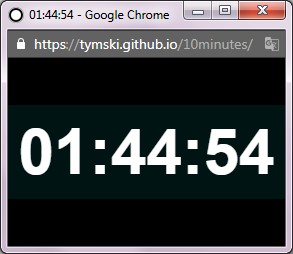

# Timer

This is a Timer with 10 minutes as default value. Type in the text field your desired timer duration and press Enter.

Timer is available here: [tymski.github.io/10minutes](https://tymski.github.io/10minutes/)  
  

## Usage

Write how long your timer should be, for example:

* __20:00__ - 20 minutes
* __20:__ - 20 minutes (you can omit zeros)
* __1:00:00__ - one hour
* __1::__ - one hour (you can omit zeros)

You can also provide a title for the timer, like so:

* __10:00 Eggs__ - Timer with Eggs as a title
* __1:30:00 Laundry__ - Timer with Laundry as a title

You can use GET parameters *time* and *title* like this:  
* [tymski.github.io/10minutes?time=1:30:00&title=Laundry](https://tymski.github.io/10minutes/?time=1:30:00&title=Laundry)  
* [tymski.github.io/10minutes?time=0:10:00&title=Eggs](https://tymski.github.io/10minutes/?time=0:10:00&title=Eggs)

## Additional features

* Style changes when you resize to smaller window. 
* Window title shows timer.
* Can be used offline thanks to Service Worker caching.

## Installation

It can be installed and work offline like any Progressive Web App.  
For example, on Android click the three dot menu on top right and choose "Add To Home Screen" option.

## Basic meta info

* **Technology:** HTML + CSS + JS + PWA
* **Goal:** create simplistic, functional, good looking online timer
* **Address:** [tymski.github.io/10minutes](https://tymski.github.io/10minutes/)

## TODO

* **Icons:** for all platforms and sizes - svg?
* **ServiceWorker:** add prefetching and removing old caches
* Add h m s support like: 1h 30m, 2h40m
* Reduce content-blocking css (Audit)
